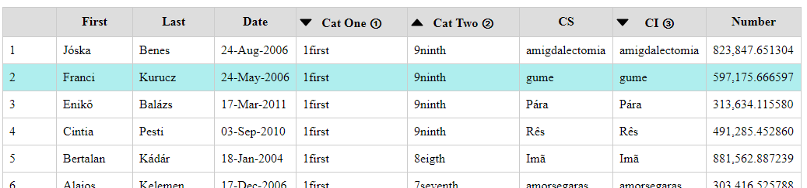

# tableSorterMulti
tableSorterMulti is a jQuery plugin that allows an html table to be sorted by clicking on its header cells. Multiple columns can be sorted in order.

## Prepare the html table 
- Add 'sorter-header' class to table header row (tr) and classes: 'no-sort', 'is-date', 'is-number' and 'case-sensitive' to the header cells (th) to indicate how to sort the columns. Case insensitive is the default. 
- Note that you cannot use your own classes that have names with 'sort-' in the header cells (th) since these classes will be removed by the plugin.
```html
<table class="sortable-table indexed">
    <tbody>
        <tr class="sorter-header">
            <th class="no-sort">&nbsp;</th>
            <th>First</th>
            <th>Last</th>
            <th class="is-date">Date</th>
            <th>Cat One</th>
            <th>Cat Two</th>
            <th class="case-sensitive">CS</th>
            <th>CI</th>
            <th class="is-number">Number</th>
        </tr> ....
```

## Initialise 
- Include http://code.jquery.com/jquery-latest.min.js & tableSorterMulti.js.
- Initialise tableSorterMulti.
```html
<script src="http://code.jquery.com/jquery-latest.min.js"></script>
<script src="./js/table-sorter-multi.js"></script>
// initialise tables sorter in external JavaScript file
<script src="./js/script-multi.js"></script>
// or initialise in header script
<script> 
  $().ready(function(){
    $('.sortable-table').tableSorterMulti(3); 
  });
</script>
```

- Here 3 is the number of columns by which the table will be sorted. If you want more than 5 levels of sortability (yeah right) then you will need to update the CSS file. 

## Creating an index column

- To create an index column (based only on CSS) add the class 'indexed' to the table, each table row (tr) that needs to be indexed and the table cell (td) where the index needs to go. The table cell need to have an empty span.

```html
<table class="sortable-table indexed">
<tr class="indexed">
    <td class="indexed">
        <span>&nbsp;</span>
    </td>
    <td> ....

```